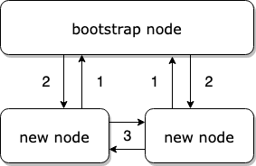
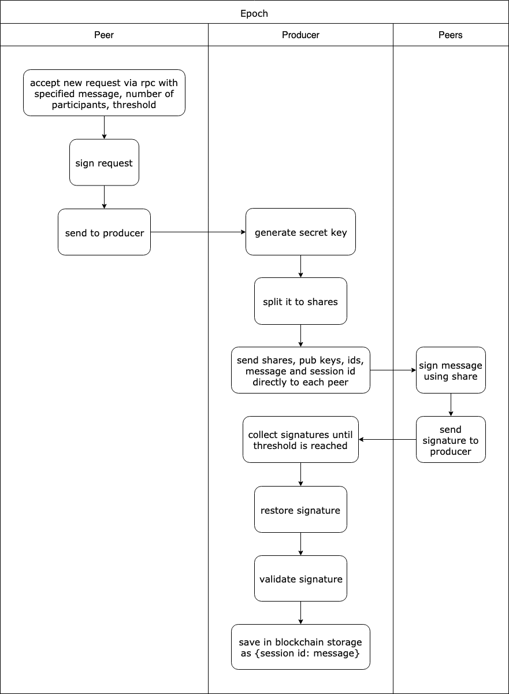

# libp2p-blockchain

*Experimental* blockchain based on [`libp2p`](https://github.com/libp2p/js-libp2p).

Peers select random block producer automatically at the end of every minute.
Currently finally selected producer is first one among sorted list of proposed peers.
In future it can be the most reach peer among proposed, like in PoS.
Anyone can change storage and balances.
All transaction are free.
Bootstrap peer gets all the funds when create new chain.
All communication between peers is encrypted with `secio`.
For signing transactions and blocks 2048 bits `rsa` is used. In future can be replaced with [`secp256k1`](https://github.com/libp2p/js-libp2p-crypto-secp256k1).
For bls [`bls-lib`](https://github.com/dfinity/js-bls-lib) is used with `FP254BNB` curve.

Currently list of peers and state of storage and balances is saved only in memory.
In future it can be changed.
Also can be added support of [`EVM`](https://github.com/ethereumjs/ethereumjs-vm). 

## Run

To run with pregenerated keys just start peers starting from bootstrap peer `peer0`. 

1. `npm run peer0`

2. `npm run peer1`

3. `npm run peer2`

Try json-rpc api

`curl -X POST -H 'content-type: application/json' -d '{"jsonrpc":"2.0","id":1,"method":"addTransaction","params":{"state":{"storage":{"key":"value"}}}}' localhost:3000`

`curl -X POST -H 'content-type: application/json' -d '{"jsonrpc":"2.0","id":1,"method":"get","params":["state","storage","key"]}' localhost:3001`

`curl -X POST -H 'content-type: application/json' -d '{"jsonrpc":"2.0","id":1,"method":"bls","params":{"message":"hello","numOfPlayers":3,"threshold":2}}' localhost:3000`

To generate new keys use `util/generate-peer.js` then make sure you pass them as arguments to `src/start.js`.

## Demo

https://www.youtube.com/watch?v=g2JcNDu6WJo

## How it works

### Connecting

1. New nodes connects to known bootstrap node (in future list of peers will be cached and bootstrap node will be required only for first run)

2. Bootstrap node share with new peers list of all currently connected peers

3. New nodes connect to each other

### Selecting producer

### Creating tx

### BLS

